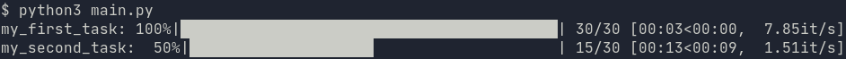
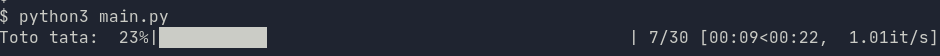
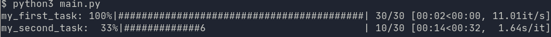

# nornir_progressbar
[](https://developer.cisco.com/codeexchange/github/repo/matman26/nornir_csv)

nornir_progressbar is a runner plugin for turning your task executions into 
nice-looking tqdm progress bars. It can be used with both of Nornir's 
standard Runners:
+ SerialRunner
+ ThreadedRunner

## Installation
Install the [package](https://pypi.org/project/nornir-progressbar/) from PyPi with pip.

```
pip install nornir-progressbar
```

## Usage
Be sure to register the RunnerPlugin within your Nornir script before using it.

To use the Multi-threaded execution, register the class ThreadedProgressBarRunner:
```python
from nornir_progressbar.plugins.runners import ThreadedProgressBarRunner
from nornir.core.plugins.runners import RunnersPluginRegister
from nornir import InitNornir

RunnersPluginRegister.register("ProgressBar", ThreadedProgressBarRunner)

nr = InitNornir(config_file='sample_config.yaml')
```

For serial executions, use SerialProgressBarRunner instead:
```python
from nornir_progressbar.plugins.runners import SerialProgressBarRunner
from nornir.core.plugins.runners import RunnersPluginRegister
from nornir import InitNornir

RunnersPluginRegister.register("ProgressBar", SerialProgressBarRunner)

nr = InitNornir(config_file='sample_config.yaml')
```

Your nornir config file should point to the new runner plugin:
```yaml
---
inventory:
    plugin: SimpleInventory
    options:
        host_file: "inventory/hosts.yaml"
        group_file: "inventory/groups.yaml"
        defaults_file: "inventory/defaults.yaml"
runner:
    plugin: ProgressBar
    options:
        num_workers: 10
```

And that's it! Whenever you execute a nornir task, a progress bar will appear for 
each host in the inventory, incrementing for each host that finishes execution.
The name of the task being run is used as the progress bar's description.



## Configuration
The plugin uses tqdm to render the progress bar. Keyword arguments can be passed directly
to the tqdm() call by setting them under the plugin options. Adding a 'desc' argument will
provide a custom description to the progress bar. Consult 
[tqdm's documentation](https://tqdm.github.io/) for all the keyword arguments supported.

```yaml
---
inventory:
    plugin: SimpleInventory
    options:
        host_file: "inventory/hosts.yaml"
        group_file: "inventory/groups.yaml"
        defaults_file: "inventory/defaults.yaml"
runner:
    plugin: ProgressBar
    options:
        num_workers: 10
        desc: Toto tata
        leave: False
```

The above configuration yields a single progress bar with description "Toto tata"
that gets replaced every time a task finishes execution.


Use the `ascii` option to get an ASCII progress bar.
```yaml
---
inventory:
    plugin: SimpleInventory
    options:
        host_file: "inventory/hosts.yaml"
        group_file: "inventory/groups.yaml"
        defaults_file: "inventory/defaults.yaml"
runner:
    plugin: ProgressBar
    options:
        num_workers: 10
        ascii: True
```


